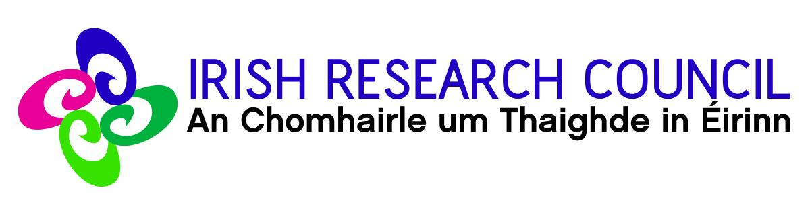

## A Story of metadata

Each time you request an access to an encrypted file on a storage server you
create metadata. That metadata will be the path to the file you asked, the time
when you asked it, your ownership of the file... An attacker spying on that
server could intercept all the metadata and then retrieve some sensitive
information even if your data itself remains encrypted. For the attacker point of
view, it is like having an access to your phone or email survey. The problem is
that you cannot hide that kind of metadata with a classic encryption scheme.

The purpose of my PhD is to work on a model that is able to hide these data to
the server: an **Oblivious Random Access Machine (ORAM)** system. This is a cryptographic
construction that allows clients to access encrypted data residing on an
untrusted storage server, while completely hiding the access patterns to storage.
Particularly, the sequence of physical addresses accessed is independent of the
actual data that the user is accessing. To achieve this, existing ORAM
constructions continuously download, re-encrypt, reshuffle and re-upload data
blocks on the storage server, to cryptographically conceal the logical access
pattern.

However, the existing ORAM schemes are limited in terms of complexity
and are therefore not practical for application in real-world storage providers.

## Acknowledgement

This work  was supported and funded by

* [Irish Research Council][irc] *(grant GOIPG/2016/479)*, the mission of the
Irish Research Council is to enable and sustain a vibrant research community in
Ireland by supporting excellent researchers in all disciplines.
[#LoveIrishResearch](https://twitter.com/hashtag/LoveIrishResearch)
* The [Lero][lero], the Irish Software Research Centre.

[][irc]
[][lero]

[lero]: http://www.lero.ie/
[irc]: http://www.research.ie/
